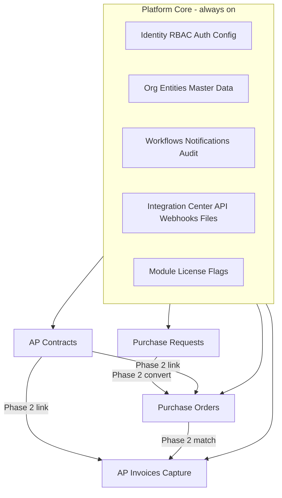

# Aptora — AP / P2P Product Blueprint

**Product name:** **Aptora** (AP + “aura” — finance-native, pronounceable EN/EU)  
**Alternates (if domain/trademark blocks):** Invora, Ordo, Vouchly  
**Former working name:** Formify  
**Document type:** Ready-to-sell product blueprint (product + UX + architecture + GTM)  
**Audience:** Founder / product leader briefing design & engineering  
**Date:** 2026-08-26 (decisions locked)

---

## Locked decisions & assumptions

| Topic | Decision |
|---|---|
| Brand | **Aptora** (horizontal finance/AP market name) |
| Buyers | Mid-market → upper mid-market finance/procurement; expandable to enterprise |
| Market | **Universal / horizontal** — not vertical-specific |
| Delivery | Multi-tenant SaaS first; dedicated tenant / private cloud path later |
| Regions | US + EU (GDPR) first; multi-region capable |
| Product sequence | **Invoices first**; **Contracts + PR + PO as second flow** |
| Capture / OCR | Cloud OCR + HITL; vendor = **AWS Textract** (best total value — see §7) |
| Payments | **Not in-app** — payment-ready / status sync only; pay in ERP/bank |
| Integrations (early) | **Integration Center** only: template upload/download + API foundation; **no ERP connectors yet** |
| Auth (early) | **Configurable architecture**; **username/password** to start; SSO/IdP later |
| Monetization | Modular subscriptions priced primarily on **transaction volume** + OCR pages |
| Clients | Cloud **web first**, then **React Native (Expo)** mobile (full capability) |
| Mobile approach | React Native (Expo) — best quality/price |
| Mobile scope | Approvals, capture, day-to-day AP, admin (after web GA) |
| Backend | **NestJS (TypeScript) modular monolith** — see §7 |

**Why Aptora:** Sounds like Accounts Payable without being literal (“AP-app”), works in US/EU sales conversations, avoids “forms” connotation of Formify, short enough for app icon + wordmark.

**Why React Native (Expo) later:** Same as prior — shared TS talent with web; ship web GA first to close deals, then mobile ≤ one phase behind.

---

## 1. Executive product definition

**Positioning.** Aptora is a modular Accounts Payable and Procure-to-Pay cloud suite — starting with invoice capture and processing, then expanding into contracts, purchase requests, and purchase orders. Finance teams buy modules independently, run on a calm high-speed web app (mobile follows), move data through an Integration Center and open APIs, and keep paying vendors in their existing bank/ERP — Aptora stops at payment-ready.

### Target users & buyers

| Persona | Role | Primary job |
|---|---|---|
| **AP Clerk / Processor** | Daily operator | Clear invoice queue, resolve exceptions, code & match |
| **Requester** | Employee / buyer | Raise PR, track status (Phase 2) |
| **Approver** | Manager / budget owner | Approve in seconds |
| **Procurement** | Buyer | Contracts, POs (Phase 2) |
| **AP Manager / Controller** | Value buyer | Cycle time, controls, audit, STP rate |
| **CFO / VP Finance** | Economic buyer | Cost-to-serve, risk, modular price vs volume |
| **IT / Security** | Technical buyer | Auth config path, APIs, residency, SOC2 |

### Jobs-to-be-done

- “When invoices arrive, clear them with minimal re-keying.”
- “When we grow into procurement control, turn on PR/PO/contracts without rip-and-replace.”
- “When we sync to ERP, start with templates/API — connectors when we’re ready.”
- “When auditors ask, show immutable history.”
- “When I’m on mobile (later), approve and capture without waiting for desktop.”

### Competitors & differentiation

**Comps:** Coupa, SAP Ariba, Oracle Fusion AP, Tipalti, Bill.com, Melio, Stampli, MineralTree, AvidXchange, ERP-native AP.

**Thesis:** Mid-market wants Stampli-like clarity with a path to suite depth — without Coupa weight or forced payments. Aptora wins on modular land-and-expand (invoices → procure), Integration Center honesty (templates first), and UX that feels best-in-class.

### Why we win (5)

1. **Invoice workstation excellence** — worklists, HITL OCR, exception triage at category-best speed.
2. **True modularity** — land Invoices; enable Contracts/PR/PO when ready.
3. **Integration honesty** — Integration Center + templates + API/OAuth gateway before brittle connector farm.
4. **Configurable control plane** — auth, workflows, modules designed for plug-in growth; simple password login on day one.
5. **Volume-aligned pricing** — pay for transaction throughput, not seat theater.

---

## 2. Modular product architecture



### Dependency map

| Module | Requires | Soft-links |
|---|---|---|
| Platform Core | — | — |
| AP Invoices | Platform Core + Capture | PO/Contracts when licensed |
| AP Contracts | Platform Core | PO, Invoices |
| Purchase Requests | Platform Core | PO |
| Purchase Orders | Platform Core | PR, Contracts, Invoices |

**Rule:** Revenue modules never hard-require each other. Matching activates when PO is licensed.

---

### Platform Core

| | |
|---|---|
| **Purpose** | Tenant, identity, org, master data, workflows, files, audit, Integration Center, module flags |
| **Must-have** | Multi-tenant orgs/entities; users/roles/permissions; **username/password auth** with pluggable auth config; approval engine; notifications; document store; audit; feature flags; admin; global search; **Integration Center (templates + job log)**; API keys foundation |
| **Later** | SSO OIDC/SAML, SCIM, OAuth client apps for partners, connector packs |
| **Key objects** | Tenant, Entity, User, Role, Permission, AuthProviderConfig, Vendor, GLAccount, CostCenter, TaxCode, PaymentTerm, UoM, Location, Project, WorkflowDefinition, ApprovalTask, FileAsset, IntegrationJob, TemplateDefinition, AuditEvent, ModuleLicense |
| **Licensing** | Included with any paid module |

### AP Invoices (+ Capture) — **Phase 1 commercial wedge**

| | |
|---|---|
| **Purpose** | Capture, validate, code, approve, export payment-ready invoices |
| **Must-have** | Email/upload/API capture; OCR; vendor match; duplicates; header/lines; GL coding; tolerances; exceptions; approvals; **export via Integration Center templates/API**; doc viewer |
| **Phase 2+** | 2/3-way match (when PO on), contract checks, mobile camera path, vendor portal |
| **States** | Captured → Extracting → NeedsReview → Matching → Exception → InApproval → Approved → Exported → Paid*(status only)* / Void |
| **Alone** | Full non-PO AP automation |
| **Licensing** | Paid + OCR page meter; transactions count toward volume tier |

### AP Contracts / PR / PO — **Phase 2 flow**

Same capability depth as prior blueprint (lifecycle, approvals, convert PR→PO, receiving, match readiness). Shipped as the **second commercial flow** after Invoices is selling.

| Module | Alone | With Invoices |
|---|---|---|
| Contracts | Full lifecycle | Link/validate on invoice |
| PR | Ends at Approved + template export | Reference on invoice optional |
| PO | Issue + receive + export | 2/3-way match |

---

## 3. End-to-end process design

### 3.1 Invoices + scanning (Phase 1 — primary)

**Happy path:** Ingest (email/upload/API) → OCR → vendor+fields → validate → code → (optional match hooks stubbed) → approve if needed → **Export batch via Integration Center** (template file or API pull) → mark Exported; Paid status optional manual/API later.

**Primary screens:** Capture inbox; **Invoice workspace**; Exception queue; Approval inbox; Export / Integration jobs; Vendor & GL admin.

**Exception categories:** `DUP`, `VENDOR_UNMATCHED`, `CODING`, `TAX`, `OCR_LOW`, `POLICY`, `ENTITY`, `PO_*` (when PO module on).

**SLAs:** Extraction p95 < 2 min; exception age alerts; approval reminders; failed export alerts.

### 3.2 Contracts → PR → PO (Phase 2 — second flow)

- **Contracts:** Draft → approve → active → amend/renew/expire  
- **PR:** Create → approve → convert to PO or export  
- **PO:** Create/issue → change orders → receive → match-ready for invoices  

Cross-cutting: delegation, escalation, audit, comments, attachments, versioning — from Phase 1 platform onward.

### 3.3 Integration Center flows (Phase 1)

1. Download **CSV/XLSX template** (vendors, COA, open invoices export, approved invoices export, etc.)  
2. Upload filled template → validation report → commit/reject  
3. View **job history**, errors per row, replay  
4. Later: map fields, schedule pulls, connectors (out of Phase 1 scope)

---

## 4. World-class UX / UI system brief

### Visual direction — “Ledger Light” (Aptora)

| Token | Direction |
|---|---|
| **Brand** | **Aptora** wordmark as hero on marketing; precise in-app mark |
| **Typography** | Display: Fraunces or Newsreader; UI: Geist / IBM Plex Sans |
| **Color** | Ink `#0F1914`, paper `#F7F6F2`, signal teal `#0F766E`, amber alert, crimson danger |
| **Atmosphere** | Soft paper grain on marketing; calm structured surfaces in-app |

### Principles

1. Clarity over chrome  
2. Speed to decision  
3. Progressive disclosure  
4. Trust visible (amount, entity, vendor, audit)  
5. Web cockpit first; mobile full product second — same design system  

### IA (module-aware)

- **My work** → **Invoices** (Phase 1) → Directory → Analytics → **Integration Center** → Admin  
- Phase 2 adds Contracts, Requests, Orders when licensed  
- Search: `Cmd/Ctrl+K`

### Patterns

Sortable/filterable worklists, saved views, bulk actions, keyboard, side-by-side invoice viewer, AI suggestion chips (apply explicitly), Integration Center with template UX as first-class (not a buried import modal).

### Device strategy

| Phase | Surface |
|---|---|
| **Phase 1 GA** | Desktop web (+ usable tablet browser) |
| **Phase 1.5 / 2** | React Native Expo — full capability including camera capture & admin |

### Magical screens (Phase 1 priority)

1. My Work  
2. Invoice workspace  
3. Exception queue  
4. Saved views  
5. Approval sheet  
6. Integration Center (templates + job log)  
7. Vendor 360 (invoice history first)  
8. Workflow simple designer  
9. Module/license admin  
10. Capture inbox  

(Mobile camera capture & thumb approval join the “magical” list when mobile ships.)

---

## 5. Functional best-practice catalog

| Area | Capability | P | Notes |
|---|---|---|---|
| Master data | Vendors, GL, CC, tax, terms, entities, etc. | P0 | Template import via Integration Center |
| Users | Username/password, roles, permissions | P0 | |
| Users | Auth provider config framework | P0 | UI to add SSO later without rewrite |
| Users | SSO OIDC/SAML, SCIM | P1/P2 | After password era |
| Workflows | Routing, serial/parallel, delegate, escalate | P0 | |
| Invoices | Capture, OCR HITL, coding, approvals, export | P0 | Wedge |
| Matching | 2/3-way | P1 | With PO module |
| Contracts / PR / PO | Full lifecycles | P1 | Second flow |
| Integration Center | Templates upload/download, validation, jobs | P0 | |
| Connectors | QBO/Xero/NetSuite/BC | P2 | Explicitly later |
| Payments | In-app execution | — | **Out of scope** |
| Payments | Exported / Paid status fields | P0/P1 | Status only |
| AI | Coding suggest, dup, anomaly | P0/P1 | |
| Audit | Immutable log, retention | P0 | |
| Reporting | Ops dashboards + export | P0 | |
| Mobile | Full RN app | P1 | After web |
| Notifications | Email + in-app; push with mobile | P0/P1 | |

---

## 6. Integration & open authorization gateways

### Phase 1 philosophy

**Integration Center + API-ready core — not connector theater.**

| Capability | Phase 1 | Later |
|---|---|---|
| CSV/XLSX templates in/out | Yes | — |
| Validation + job log | Yes | — |
| REST API (OpenAPI) for objects | Yes (authenticated) | Expand |
| Webhooks | Stub / basic P1 | Full |
| OAuth clients for partners | Design now, enable later | Yes |
| ERP connectors | **No** | Pack roadmap |
| iPaaS | Via public API when stable | Recipes |
| RPA | Not productized | Avoid |

### Canonical template sets (Phase 1)

- Vendors (upsert)  
- Chart of accounts / cost centers  
- Approved invoices export (payment-ready)  
- Invoice status import (optional Paid/Void from ERP)  
- Users (optional)

### AuthN / AuthZ roadmap

| Stage | Auth |
|---|---|
| Now | Local username/password; hashed credentials; session/JWT; lockout; invite/reset |
| Config model | `AuthProviderConfig` — `local` enabled; future `oidc` / `saml` records |
| Later | OIDC/SAML SSO, SCIM, OAuth2 apps, granular API scopes |

**Security:** tenant isolation, TLS, encryption at rest, secrets vault, API audit — from day one even with password-only login.

---

## 7. Technology recommendation (opinionated)

### Backend choice — **NestJS (TypeScript) modular monolith**

**Why this wins for Aptora given your constraints:**

| Factor | NestJS | .NET 8 | Java/Spring |
|---|---|---|---|
| Shared types with React + future RN | Excellent | Weak | Weak |
| Modular monolith / bounded contexts | Excellent | Excellent | Excellent |
| Time-to-first Invoice wedge | Fastest with your web stack | Fast if .NET team exists | Slower DX |
| Finance audit + transactions | Excellent with Postgres | Excellent | Excellent |
| Hiring for web+API+later mobile | One TS pool | Split | Split |
| Mid-market SaaS TCO | Best fit | Better if selling only to Microsoft shops | Heavy |

**.NET** remains Plan B only if you hire a .NET-majority team; default is **NestJS**.

### OCR — **AWS Textract** (Analyze Expense + Queries)

**Best value-for-cost at your stage:**

| Option | Verdict |
|---|---|
| **AWS Textract** | **Selected** — strong invoice/expense extraction, page-priced, same cloud as hosting → lower eng + billing + residency friction; HITL covers edge cases |
| Azure Document Intelligence | Excellent invoice model; adds second-cloud vendor complexity |
| Google Document AI Invoice Parser | Top accuracy band; usually worse $/page for mid-market volumes |
| Veryfi / Mindee / Rossum | Good specialists; Rossum pricey; keep as bake-off if Textract STP stagnates |

**Rule:** Buy OCR; invest eng in **Aptora HITL workspace + per-vendor learning**, not training base models.

### Full Stage-1 stack

| Layer | Choice |
|---|---|
| Web | React + TypeScript + Vite; TanStack Query/Table; Tailwind + tokens |
| Mobile (later) | React Native + Expo (EAS) |
| Monorepo | pnpm + Turborepo (`api`, `web`, future `mobile`, `types`, `ui`) |
| API | NestJS modular monolith |
| DB | PostgreSQL |
| Search | Postgres FTS → Typesense when needed |
| Files | S3 + virus scan |
| OCR | AWS Textract |
| Workflows | In-house state machine + job queue |
| Auth | First-party local auth in NestJS + `AuthProviderConfig` for future IdPs |
| Jobs | SQS or Redis/BullMQ |
| Observability | OpenTelemetry → Grafana or Datadog |
| Tests | Playwright, Vitest/Jest, API contract tests |

### Multi-tenancy & modules

Shared DB + `tenant_id` + isolation tests; `module_licenses` + feature flags; graceful soft-links when modules off.

### Money & transactions

Store money as integer minor units + currency; **billable transaction** = countable business event (e.g. invoice captured or invoice approved — pick one definition and keep it; recommend **invoice reaching Approved/Exported** as billable unit, plus OCR pages as usage).

---

## 8. Hosting & operating model

**Primary:** AWS (`us-east-1` + `eu-west-1`) — ECS/EKS, RDS Postgres, S3, SQS, Textract, CloudFront, WAF.

**Envs:** dev → staging → prod; GitHub Actions; Expo channels when mobile exists.

**DR (Stage 1):** RPO ≤ 1h; RTO ≤ 4h; ingest availability 99.9%.

**COGS drivers:** OCR pages, storage, compute, support (UX reduces), later mobile stores.

**Compliance:** SOC 2 → ISO 27001; GDPR DPA; EU data pin.

**Enterprise later:** dedicated tenant/VPC; same codebase.

---

## 9. Packaging, pricing & GTM readiness

### Platform Core (included)

Identity (password + future auth config), RBAC, workflows, master data, audit, **Integration Center**, API foundation, web client, notifications.

### Paid modules

| SKU | When |
|---|---|
| **Invoices** | Phase 1 — sell now |
| **Contracts** | Phase 2 |
| **Purchase Requests** | Phase 2 |
| **Purchase Orders** | Phase 2 |
| **Suite** | Bundle discount |

### Pricing model — **per transaction volume**

| Meter | Role |
|---|---|
| **Billable transactions / month** | Primary subscription bands (recommend: invoices approved or exported) |
| **OCR pages** | Usage overage or included buckets |
| Seats | Soft cap only if abuse; not primary SKU |

Suggested packages:

| Package | Contents |
|---|---|
| **Aptora AP** | Platform + Invoices |
| **Aptora Procure** | + PR + PO (+ Contracts optional add) |
| **Aptora Full** | All modules |

### Onboarding

Self-serve Aptora AP: templates for vendors/COA → inbound email → 3 sample invoices → first export template.  
Assisted for multi-entity / complex workflows.

### &lt;1 day / &lt;1 week checklists

**<1 day:** tenant, admin user (password), enable Invoices, sample master data via template, process samples, download payment-ready export.  
**<1 week:** real vendors/COA import, approval policy, mailbox cutover, train clerks, weekly volume baseline for pricing tier.

### Deal killers → answers

| Risk | Answer |
|---|---|
| “No native NetSuite connector” | Integration Center templates + API now; connectors on roadmap — faster go-live than waiting |
| “No payments” | Intentional — ERP/bank remains payment system; we deliver payment-ready accuracy |
| “Mobile?” | Web GA first; mobile full app next — same product |
| “SSO required day 1” | Password + enterprise-ready auth config; SSO scheduled — or hold deal to SSO milestone if blocker |

---

## 10. Delivery roadmap

### Phase 0 — Foundations

NestJS modular monolith, Postgres, tenancy, local auth + AuthProviderConfig, design system, web shell, module flags, audit, CI/CD, Integration Center skeleton.

**Demo:** admin invites user, toggles Invoices module, uploads vendor template.

### Phase 1 — Sellable wedge: **Aptora AP (Invoices + Capture + Integration Center)**

OCR (Textract), HITL workspace, coding, approvals, exceptions, email/upload ingest, template export of payment-ready invoices, volume metering hooks, horizontal mid-market positioning.

**Success:** paying customers on transaction tiers; STP↑; exception age↓.  
**Close demo:** upload/email invoice → resolve exception → approve → export template for ERP/bank pay run.

### Phase 1.5 — Web harden + mobile start

SOC2 evidence, webhook v1, auth SSO provider #1 if deals require; **begin Expo app** (approve + capture + lists).

### Phase 2 — Second flow: **Contracts + PR + PO**

Procurement suite, PR→PO, receiving, 2/3-way match into Invoices, richer Integration Center mappings.

**Demo:** PR→PO→invoice match→export.

### Phase 3 — Ecosystem

ERP connectors, partner OAuth, dedicated tenants, SCIM, advanced SoD — still **no requirement** for in-app payments.

---

## 11. Success metrics & quality bar

| KPI | Direction |
|---|---|
| Straight-through rate | ↑ after vendor learning |
| Capture→approve median time | ↓ |
| Exception cycle time | &lt; 2 business days median |
| Export job success | &gt; 99.5% |
| Billable transactions / account | Healthy utilization vs tier |
| Time-to-first-export (new tenant) | &lt; 1 day guided |

**UX bar:** clerk processes real invoice unsupervised in ~15 minutes; Integration Center errors are human-readable per row.

**SLOs:** API 99.9%; OCR pipeline p95 &lt; 2 min; zero cross-tenant leaks.

---

## 12. Decisions status

| # | Topic | Status |
|---|---|---|
| 1 | Name | **Locked: Aptora** (alts: Invora, Ordo, Vouchly) |
| 2 | Wedge | **Locked: Invoices first; Contracts/PR/PO second** |
| 3 | Integrations | **Locked: Integration Center + templates; connectors later** |
| 4 | Payments | **Locked: not in-app** |
| 5 | Market | **Locked: horizontal** |
| 6 | OCR | **Locked: AWS Textract** (value) |
| 7 | Auth | **Locked: configurable; password first; SSO later** |
| 8 | Backend | **Locked: NestJS TS modular monolith** |
| 9 | Pricing | **Locked: per transaction volume (+ OCR pages)** |
| 10 | Clients | **Locked: web first, then RN mobile** |

### Remaining micro-decisions (optional)

1. Exact **billable transaction** definition: `invoice.approved` vs `invoice.exported` vs `invoice.captured`  
2. Trademark/domain check for **Aptora**  
3. First SSO provider when needed (Google vs Microsoft Entra vs Okta)

---

## Appendix A — Integration Center (Phase 1 scope box)

**In:** template catalog, download, upload, schema versioning, row validation, dry-run, commit, error CSV, job history, permissions.  
**Out:** hosted connector runtime, vendor-specific ERP auth, payment rails, RPA bots.

## Appendix B — Auth configurability (build now)

```text
AuthProviderConfig {
  type: 'local' | 'oidc' | 'saml'  // only local enabled at GA
  enabled: boolean
  order: number
  settings: jsonb  // empty for local; clientId/metadataUrl later
}
```

Password policy, MFA-ready flags (optional TOTP as early upsell), and session controls should exist even before SSO.

## Appendix C — Rename map

All product copy, repo branding, and marketing should migrate **Formify → Aptora**. Keep git repo rename as a separate ops task if desired.
