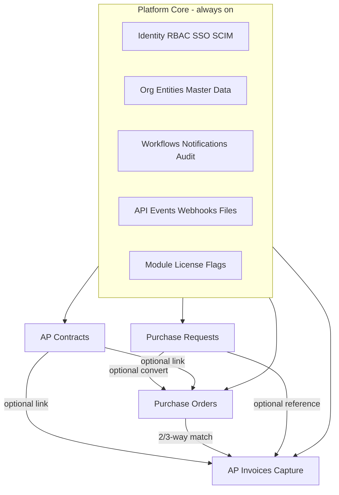

# Formify — AP / P2P Product Blueprint

**Working name:** Formify  
**Document type:** Ready-to-sell product blueprint (product + UX + architecture + GTM)  
**Audience:** Founder / product leader briefing design & engineering  
**Date:** 2026-08-26

---

## Locked decisions & assumptions

| Topic | Decision |
|---|---|
| Buyers | Mid-market → upper mid-market finance/procurement; expandable to enterprise |
| Delivery | Multi-tenant SaaS first; dedicated tenant / private cloud path later |
| Regions | US + EU (GDPR) first; multi-region capable |
| Capture | Cloud OCR + human-in-the-loop exceptions |
| Monetization | Modular subscriptions + OCR/page usage |
| Clients | **Cloud web app (primary workstation) + mobile apps (full capability)** |
| Mobile approach | **React Native (Expo)** — best quality/price vs native dual-stack or PWA-only |
| Mobile scope | Approvals, capture, day-to-day AP work, **and** admin/setup (responsive IA, not a stripped toy) |

**Why React Native (Expo) wins quality vs price**

- One TypeScript/React talent pool for web + mobile → lower hiring and coordination cost than Swift+Kotlin.
- Near-native UX, camera, push, offline drafts, App Store / Play presence — materially better than PWA for invoice capture and approvals-on-the-go.
- Expo speeds CI, OTA updates, and store submission vs bare RN or two native apps.
- Flutter can look slightly “prettier” out of the box, but splits the skill stack from a React web app and raises long-term TCO.
- Native dual apps = highest polish ceiling, ~1.6–2× mobile eng cost for mid-market SaaS — poor quality/price until enterprise scale demands it.

**Assumption:** Brand name remains Formify unless replaced; visual system below is Formify-specific and deliberately *not* generic purple SaaS.

---

## 1. Executive product definition

**Positioning.** Formify is a modular Accounts Payable and Procure-to-Pay cloud suite — contracts, purchase requests, purchase orders, and invoice automation with capture — that finance teams can buy as one module or the full stack. It feels calm and fast on desktop and fully capable on mobile, connects cleanly to ERPs via open APIs and OAuth, and is built to sell as multi-tenant SaaS from day one.

### Target users & buyers

| Persona | Role | Primary job |
|---|---|---|
| **AP Clerk / Processor** | Daily operator | Clear invoice queue, resolve exceptions, code & match |
| **Requester** | Employee / buyer | Raise PR, track status, attach needs |
| **Approver (manager / budget owner)** | Decision maker | Approve on web or phone in seconds |
| **Procurement** | Buyer / category | Contracts, POs, vendor terms, change orders |
| **AP Manager / Controller** | Buyer of value | Cycle time, controls, audit, straight-through rate |
| **CFO / VP Finance** | Economic buyer | Risk, cost-to-serve, ERP fit, compliance |
| **IT / Security** | Technical buyer | SSO, SCIM, APIs, data residency, SOC2 |

### Jobs-to-be-done

- “When invoices arrive from email/scan/vendor portals, clear them with minimal re-keying.”
- “When spend needs approval, route the right people with policy, not email chaos.”
- “When we only need invoices (or only PR/PO), buy that — and grow into the suite later.”
- “When I’m away from desk, approve, capture, and unblock exceptions from my phone.”
- “When auditors ask, show immutable history without exporting to Excel archaeology.”

### Competitors & differentiation

**Comps:** Coupa, SAP Ariba, Oracle Fusion AP, Tipalti, Bill.com, Melio, Stampli, MineralTree, AvidXchange, mid-market ERP-native AP.

**Thesis:** Enterprise suites are powerful but heavy and expensive; point AP tools are friendly but shallow on PR/PO/contracts and modular packaging. Formify wins the mid-market “suite without the suite tax”: modular enablement, open gateways, and a UX that treats AP work as a craft product — not a port of ERP forms — on **both** web and mobile.

### Why we win (5)

1. **Best-in-class worklists** — filters, saved views, keyboard, bulk actions, exception triage that feels like Linear/Notion speed with finance trust.
2. **True modularity** — Contracts / PR / PO / Invoices independently licensed; Platform Core shared; nav and data integrity stay coherent.
3. **Dual-client by design** — web for deep work; React Native for full operational + admin capability with camera-native capture.
4. **Open authorization & integration** — OIDC SSO, OAuth API clients, webhooks, ERP adapters — standalone *or* embedded in the finance stack.
5. **Progressive power** — simple defaults; tolerances, matrix approvals, SoD, multi-entity available without day-1 complexity.

---

## 2. Modular product architecture

### Dependency map

| Module | Requires | Soft-links (optional) |
|---|---|---|
| Platform Core | — | — |
| AP Contracts | Platform Core | PO, Invoices |
| Purchase Requests | Platform Core | PO (convert), Invoices (ref) |
| Purchase Orders | Platform Core | PR (source), Contracts, Receiving, Invoices |
| AP Invoices | Platform Core + Capture pipeline | PO (match), Contracts, PR |

**Rule:** No hard runtime dependency between revenue modules. Matching against PO is a **capability** that activates when PO module is licensed; otherwise invoices support non-PO / contract / cost-only coding paths.

---

### Platform Core

| | |
|---|---|
| **Purpose** | Tenant, identity, org structure, master data, workflows, files, audit, integrations, module flags |
| **Must-have** | Multi-tenant orgs & entities; users/roles/permissions; SSO (OIDC/SAML); email+password optional; approval engine; notification center; document store; audit log; feature/module flags; admin console (web + mobile); global search; API keys & OAuth apps |
| **Phase-2** | SCIM; advanced SoD matrices; customer UI theming; sandbox tenants; iPaaS recipes marketplace |
| **Key objects** | Tenant, Entity, User, Role, Permission, Vendor, GL Account, CostCenter, TaxCode, PaymentTerm, UoM, Location, Project, WorkflowDefinition, ApprovalTask, FileAsset, IntegrationConnection, AuditEvent, ModuleLicense |
| **Alone** | N/A — always on |
| **Licensing** | Included with any paid module; not sold empty |

### AP Contracts / Agreements

| | |
|---|---|
| **Purpose** | Supplier agreements: commercial terms, catalogues/rates, obligations, renewals |
| **Must-have** | Contract record + parties; term dates; value/currency; payment & pricing terms; attachments; approval; active/expired; amendments with versioning; link to vendors; alerts for expiry/renewal; e-sign *handshake* (DocuSign/Adobe via integration) |
| **Phase-2** | Clause library, obligation tracking, spend-against-contract, AI clause extraction |
| **States** | Draft → InApproval → Approved → Active → AmendmentDraft → Expired/Terminated/Renewed |
| **Alone** | Full contract lifecycle + reporting; no PO/invoice required |
| **With suite** | Auto-suggest on PO/invoice; contract price validation |
| **Licensing** | Paid module |

### Purchase Requests (PR)

| | |
|---|---|
| **Purpose** | Intake & authorize demand before commitment |
| **Must-have** | Line-based PR; requester; ship-to; needed-by; attachments; catalog/free-text; budget/owner coding; workflow by amount/dept; approve/reject/send-back; convert to PO (if PO on); status tracking; mobile create/approve |
| **Phase-2** | Punch-out, preferred-vendor suggestions, budget soft/hard checks, demand consolidation |
| **States** | Draft → Submitted → InApproval → Approved / Rejected / Returned → Converted / Closed / Cancelled |
| **Alone** | Ends at Approved (export/API to external purchasing) |
| **With PO** | One-click / selective line convert |
| **Licensing** | Paid module |

### Purchase Orders (PO)

| | |
|---|---|
| **Purpose** | Formalize commitment to vendor |
| **Must-have** | PO header/lines; vendor; prices/qty; tax; multi-currency; change orders; send PDF/email; acknowledgement status; receiving (goods/qty) toggle; close/cancel; match readiness flags; mobile view/approve/receive |
| **Phase-2** | ASN, blanket/release POs, advanced three-way automation, supplier portal |
| **States** | Draft → InApproval → Open → PartiallyReceived → FullyReceived → Closed / Cancelled; ChangeOrder states parallel |
| **Alone** | Manual/API-sourced POs; export to ERP |
| **With PR/Contracts/Inv** | Convert, price check, 2/3-way match |
| **Licensing** | Paid module; Receiving as included capability flag |

### AP Invoices (+ Capture)

| | |
|---|---|
| **Purpose** | Capture, validate, code, match, approve, export payment-ready invoices |
| **Must-have** | Email/upload/API/mobile camera capture; OCR; vendor match; duplicate detection; header/line extraction; GL coding; 2-way & 3-way match when PO on; tolerances; tax; exceptions queue; approvals; payment-ready export/sync; side-by-side doc viewer |
| **Phase-2** | Vendor portal submission, continuous learning per-vendor models, payments execution (or Tipalti-like partner), advanced fraud scoring |
| **States** | Captured → Extracting → NeedsReview → Matching → Exception → InApproval → Approved → Exported/Synced → Paid (status from ERP) / Void |
| **Alone** | Non-PO invoice automation + ERP sync |
| **With PO/Contracts** | Match & contract validation |
| **Licensing** | Paid module + **OCR page usage** meter |

---

## 3. End-to-end process design

### 3.1 Contracts

**Happy path:** Create draft → add parties/terms/attachments → submit → workflow → activate → monitor expiry → renew/amend.

**Primary screens:** Contract list (saved views); Contract detail (terms, files, activity); Approval task; Amendment diff; Renewal worklist.

**Decisions:** Who must approve by value/legal; whether e-sign required before Active; auto-remind N days before expiry.

**SLAs / notifications:** Approval pending, escalation, 90/60/30-day expiry, amendment approved.

**Exceptions:** Missing signatures, overlapping active contracts per vendor+category, expired used on PO/invoice (block or warn by policy).

### 3.2 Purchase Requests

**Happy path:** Requester creates PR (web/mobile) → coding defaults → submit → approvals (serial/parallel) → Approved → Convert to PO (if enabled) or export.

**Screens:** PR list; PR composer; Approval inbox; Conversion wizard.

**Exceptions:** Insufficient budget (P1), missing cost object, policy violation (restricted vendor), approver out-of-office → delegate.

### 3.3 Purchase Orders

**Happy path:** Create from PR or scratch → approve if required → issue to vendor → optional receive → ready for match.

**Screens:** PO list; PO detail; Change order; Receiving entry (mobile-friendly); Vendor send modal.

**Exceptions:** Price/qty change after issue, over-receipt, vendor mismatch on invoice later.

### 3.4 Invoices + scanning

**Happy path:** Ingest (email/upload/API/camera) → OCR → vendor+header/lines → validate → code → match (if PO) → auto-approve if clean → export to ERP.

**Screens (must feel magical):** Capture inbox; **Invoice workspace** (PDF + fields + match panel); Exception queue; Bulk coding; Export batch log.

**Exception categories (standard):**

| Code | Meaning |
|---|---|
| `DUP` | Duplicate invoice |
| `VENDOR_UNMATCHED` | OCR vendor confidence low |
| `PO_MISSING` / `PO_MISMATCH` | Expected PO not found / header mismatch |
| `QTY_PRICE_TOL` | Outside tolerance |
| `TAX` | Tax mismatch |
| `CODING` | Missing/invalid GL or cost objects |
| `OCR_LOW` | Low field confidence |
| `POLICY` | SoD / amount / restricted |
| `ENTITY` | Wrong legal entity |

**SLAs:** Extraction < 2 min p95; exception age alerts; approver reminders; stuck-in-export alerts.

### 3.5 Cross-cutting

- **Delegation & OOO** with time-boxed rights  
- **Escalation** by SLA on approval tasks  
- **Audit trail** on every state/field change (who/when/before/after)  
- **Comments @mentions** on documents  
- **Attachments** with virus scan  
- **Versioning** on contracts & PO change orders  
- **Mobile parity** for tasks, capture, lists, detail edit, and admin (see §4)

---

## 4. World-class UX / UI system brief

### Visual direction — “Ledger Light”

Avoid purple-glow SaaS, cream-terracotta cliché, and broadsheet density.

| Token | Direction |
|---|---|
| **Brand signal** | Wordmark **Formify** as hero-level identity in marketing; in-app, persistent precise mark + product area title |
| **Typography** | Display: *Fraunces* or *Newsreader*; UI: *Söhne* / *Geist* / *IBM Plex Sans* — expressive but finance-serious |
| **Color** | Deep ink `#0F1914`, paper `#F7F6F2`, signal teal `#0F766E`, alert amber, danger crimson — cool northern-finance, not neon |
| **Atmosphere** | Soft paper grain + restrained gradient washes in marketing; in-app: structured white surfaces, hairline separators, generous density controls |
| **Imagery** | Real document/workspace photography for marketing; in-product: live document canvas, not illustrations |

### Design principles

1. **Clarity over chrome** — every screen one job.  
2. **Speed to decision** — approvers succeed in < 30 seconds.  
3. **Progressive disclosure** — advanced match/tax behind “Adjust,” not walls of fields.  
4. **Trust visible** — amounts, entity, vendor, audit cues always scannable.  
5. **Same product, two canvases** — web = cockpit; mobile = full product with thumb-first patterns, not a unread-only app.

### Information architecture (module-aware)

- **Home / My work** — tasks, drafts, exceptions assigned to me (always).  
- **Module nav** — only licensed modules appear (Contracts, Requests, Orders, Invoices).  
- **Directory** — Vendors & master data.  
- **Analytics** — role-based dashboards.  
- **Admin** — users, workflows, integrations, module licenses, capture mailboxes (web + mobile).  
- **Search** — global `Cmd/Ctrl+K` (web) / global search sheet (mobile).

### Core interaction patterns

| Pattern | Web | Mobile |
|---|---|---|
| Worklists | Virtualized tables, column sort, facet filters, saved views, bulk select | Card/list hybrid, filter sheets, saved views, swipe actions |
| Detail | Two-pane where needed (doc + data) | Tabbed: Document / Fields / Match / Activity |
| Inline edit | Safe fields only; amount edits audited | Same with explicit Save |
| Bulk actions | Toolbar | Multi-select + bottom bar |
| AI assist | Subtle suggestions chips; never auto-post without policy | Same; “Apply suggestion” explicit |
| Capture | Drag-drop, email, upload | **Camera capture**, gallery, PDF, email-to-tenant |
| Empty/error | Honest next action | Same + offline queue status |

### Accessibility & i18n

- WCAG 2.2 AA; full keyboard on web; Dynamic Type / VoiceOver / TalkBack on mobile.  
- i18n-ready strings; number/date/currency by entity locale; RTL later (P2).

### Device strategy

| Surface | Role |
|---|---|
| **Desktop web** | Primary deep work: mass exceptions, admin, complex match, reporting |
| **Tablet web / RN tablet** | Strong approver + light processing |
| **Mobile RN** | Full capability: create/approve PR/PO, contract view/approve, invoice capture & process, master data & admin with stacked forms and search-driven pickers |

**Honest note:** Dense multi-line invoice coding is *better* on desktop; mobile must still complete the job with line editor sheets, not block users.

### Motion

Purposeful only: view transitions, task completion check, doc load fade, filter chip add/remove. No decorative parallax in app chrome.

### Critical screens that must feel magical (12)

1. My Work inbox (unified tasks)  
2. Invoice workspace (side-by-side)  
3. Exception queue with smart grouping  
4. Mobile camera capture → instant draft invoice  
5. One-thumb approval sheet with policy context  
6. PR composer with smart defaults  
7. PO receiving (mobile)  
8. Saved views builder  
9. Vendor 360 (contracts, POs, invoices, balance)  
10. Workflow designer (clarity > BPMN spaghetti)  
11. Integration connection health  
12. Module enablement / license admin  

---

## 5. Functional best-practice catalog

Priority: **P0** sellable, **P1** competitive, **P2** enterprise/expand.

| Area | Capability | P |
|---|---|---|
| Master data | Vendors, banks (masked), GL, CC, projects, tax, terms, UoM, locations, entities | P0 |
| Master data | Vendor duplicate merge, external ERP IDs | P1 |
| Users | Local users, roles, granular permissions | P0 |
| Users | SSO OIDC/SAML, invite flows | P0 |
| Users | SCIM, advanced SoD | P1/P2 |
| Workflows | Amount/dept/entity routing, serial/parallel, delegate, escalate | P0 |
| Workflows | Approval matrix UI, simulation | P1 |
| Policy/budget | Soft budget warnings | P1 |
| Policy/budget | Hard stops, project budgets | P2 |
| Matching | 2-way, 3-way, header+line, tolerances | P0 |
| Tax/FX/multi-entity | Tax codes, FX rates, entity isolation | P0 |
| Capture | Email, upload, API, mobile camera, OCR HITL | P0 |
| AI | Coding suggest, duplicate, anomaly flags | P0/P1 |
| Audit/compliance | Immutable audit, export, retention policies | P0 |
| E-sign | Integration to DocuSign/Adobe | P1 |
| Reporting | Operational dashboards, CSV/Excel export | P0 |
| Reporting | Pixel-perfect scheduled reports | P1 |
| Notifications | Email + in-app + mobile push | P0 |
| Search | Global + in-document | P0 |
| Mobile | Full module operations + admin | P0 (phased delivery inside P0 window) |
| Payments | Record status from ERP | P0 |
| Payments | Execute payments in-app | P2 / partner |

---

## 6. Integration & open authorization gateways

### Philosophy

**API-first, event-friendly, ERP-honest.** Formify can be system of process with ERP as system of record — or lighter shadow with sync both ways.

- REST (+ OpenAPI) for resources  
- Async **webhooks** + outbound event bus for status changes  
- Idempotent writes; external IDs on all syncable objects  
- iPaaS-friendly (Workato/Boomi/Make) via public API  

### Canonical objects / events (examples)

`vendor.upserted`, `pr.approved`, `po.issued`, `po.received`, `invoice.captured`, `invoice.approved`, `invoice.exported`, `contract.activated`, `approval.task_completed`

### ERP connector strategy

1. **Generic adapter** (CSV/SFTP + REST mapping) — P0  
2. **Priority connectors:** QuickBooks Online, Xero, NetSuite, Microsoft Business Central — P0/P1 by GTM  
3. **Enterprise:** SAP S/4, Oracle — P2 via partner or thin connector  

**Avoid:** brittle UI RPA as productized path (support nightmare). Allow professional-services RPA only as escape hatch.

### Ingestion

- Dedicated per-tenant inbound email  
- Upload & mobile camera  
- API & SFTP batches  
- Optional vendor portal (P1)

### Open authorization

| Mechanism | Use |
|---|---|
| OIDC/SAML | Workforce login (Okta, Entra, Google) |
| OAuth2 confidential clients | ERP/iPaaS apps; authorization code + client credentials |
| Scoped API tokens | Automation; hashed at rest; rotation |
| Admin consent | Tenant admin grants app + scopes |
| Gateway | Rate limits, WAF, per-app audit, replay protection |

**Scopes (examples):** `invoices:read`, `invoices:write`, `approvals:act`, `masterdata:read`, `webhooks:manage`

### Security

- Tenant isolation (row-level tenant_id + tested policies)  
- Encryption in transit (TLS1.2+) & at rest (KMS)  
- Secrets in vault; least-privilege roles  
- Full API access audit  
- Optional customer-managed keys (P2)

---

## 7. Technology recommendation (opinionated)

### Stage 1 stack (MVP → first 50 customers)

| Layer | Choice | Why |
|---|---|---|
| Web frontend | **React + TypeScript + Vite**; TanStack Query/Table; Tailwind + design tokens | Hiring, speed, RN skill overlap |
| Mobile | **React Native + Expo** (EAS) | Best quality/price; camera/push; shared TS types/SDK |
| Shared | Monorepo (**pnpm + Turborepo**): `ui` tokens, `api-client`, `domain-types` | Consistency web/mobile |
| Backend | **Node.js (NestJS) or .NET 8** — **default NestJS** for JS full-stack velocity; choose **.NET** if team is finance/.NET-heavy | Modular monolith, OpenAPI |
| Primary DB | **PostgreSQL** | Relational integrity, audit, RLS option |
| Search | **OpenSearch/Elastic** or Postgres + Typesense — **Postgres full-text → Typesense** when scale hits | Cost control |
| Files | **S3-compatible** (AWS S3) + CloudFront | Durability; virus scan lambda |
| OCR | **Buy:** AWS Textract or Google Document AI (+ vendor-specialized layer) | Time-to-quality; meterable COGS |
| Workflows | **In-house state machine** on Postgres + job queue (avoid Camunda day 1) | Controllable UX; migrate complexity later |
| Auth | **Auth0 / Clerk / Keycloak** — **Auth0** default for B2B SSO speed; or Cognito if AWS-pure | OIDC enterprise |
| Jobs/events | **Redis + BullMQ** or SQS + workers | Capture pipeline, webhooks |
| Observability | OpenTelemetry → Grafana/Datadog | SLO discipline |
| Tests | Playwright (web), Maestro/Detox (mobile), Jest/Vitest, contract tests for API | Regressions in money flows kill trust |

### Architecture stages

| Stage | Shape |
|---|---|
| **Stage 1** | **Modular monolith** (bounded contexts: identity, masterdata, contracts, pr, po, invoices, capture, workflow) + async workers |
| **Stage 2** | Extract **capture/OCR** and **webhook delivery** first; then connectors |

### Multi-tenancy

Shared app + **shared DB with `tenant_id`** (strict middleware + automated isolation tests). Dedicated DB/schema for enterprise SKU later.

### Module enablement

- `module_licenses` + LaunchDarkly-style **feature flags** (can build thin in-house)  
- API and UI both enforce license; soft-links degrade gracefully  

### Data model principles

- Shared `vendor_id`, `entity_id`, money as **integer minor units + currency**  
- External IDs map table  
- Event-sourced **audit** table (append-only)  
- Soft delete sparingly; financial docs void, not delete  

---

## 8. Hosting & operating model

### Primary path

**AWS** (us-east-1 + eu-west-1): EKS or ECS Fargate, RDS Postgres, S3, SQS, Textract, Cognito/Auth0, CloudFront, WAF.

**Why AWS:** OCR + enterprise procurement familiarity + IAM story. Azure is fine if Microsoft-led GTM; don’t multi-cloud early.

### Environments

`dev` → `staging` → `prod`; PR previews for web; Expo channels for mobile. GitHub Actions CI/CD; migrations gated; feature flags for risky rollout.

### Data residency

- US & EU pools; tenant pinned at signup  
- EU data stays in EU (GDPR)  
- Document metadata follows same pin  

### DR targets (Stage 1)

| Metric | Target |
|---|---|
| RPO | ≤ 1 hour (better: continuous RDS) |
| RTO | ≤ 4 hours |
| Invoice ingest availability | 99.9% |

### COGS drivers

1. OCR pages  
2. File storage/egress  
3. App compute  
4. Support (exceptions UX reduces this)  
5. Mobile store overhead (low)

### Compliance roadmap

| When | What |
|---|---|
| Pre-sale mid-market | SOC 2 Type I → Type II, GDPR DPA, pen test |
| Year 1–2 | ISO 27001 |
| Enterprise | Dedicated tenant, CMA/KMS, SIG questionnaire automation |

### Enterprise deploy later

Same containers; single-tenant RDS/VPC or private link; mobile still via public stores with tenant-specific SSO.

---

## 9. Packaging, pricing & GTM readiness

### What Platform Core includes

Identity, RBAC, SSO, workflows, master data, audit, API/webhooks, admin, **web + mobile clients**, notifications.

### Paid modules

| SKU | Includes |
|---|---|
| **Invoices** | Capture, OCR (usage), matching (PO match if PO licensed), approvals, export |
| **Purchase Requests** | PR lifecycle |
| **Purchase Orders** | PO + receiving |
| **Contracts** | Agreements lifecycle |
| **Suite** | All modules + discount |

### Suggested packages

| Package | Modules | Ideal land |
|---|---|---|
| **AP Start** | Platform + Invoices | Fastest wedge |
| **Procure** | Platform + PR + PO | Control spend before AP |
| **Full Formify** | All | Replace patchwork tools |

**Pricing intuition (directional):** per-entity or per-active-user bands + **OCR pages**; connector fees for premium ERPs.

### Onboarding

- **Self-serve:** AP Start (sample vendors, email capture, test invoice)  
- **Assisted:** Procure/Full (workflow workshops, ERP map)

### Time-to-value checklists

**< 1 day**

- [ ] Tenant + entity  
- [ ] Admin user + SSO or password  
- [ ] Enable Invoices  
- [ ] Connect inbound email / mobile capture test  
- [ ] 1 vendor + 1 GL  
- [ ] Process 3 sample invoices  

**< 1 week**

- [ ] Vendor import  
- [ ] Chart of accounts / cost centers  
- [ ] Approval policies  
- [ ] ERP export path  
- [ ] Train AP clerk + 3 approvers on mobile  
- [ ] Real mailbox cutover  

### Deal killers → product answers

| Risk | Answer |
|---|---|
| “ERP already has AP” | Better UX + capture + mobile; ERP remains ledger via sync |
| “Only need invoices now” | Modular SKU; upgrade path |
| “Security” | SOC2, SSO, audit, residency |
| “OCR accuracy” | HITL workspace + vendor learning; SLAs on exception age not fantasy 100% STP |
| “Mobile is read-only junk” | Full RN app including admin — demo camera→approve→export |

---

## 10. Delivery roadmap

### Phase 0 — Foundations

Platform Core, design system (Ledger Light), auth, tenancy, audit, CI/CD, web shell, RN app shell, module flags.

**Metric:** empty-tenant admin can invite users & toggle modules.  
**Demo:** design quality + IA.

### Phase 1 — Sellable wedge: **AP Invoices + Capture** (justify)

Highest willingness-to-pay, clearest ROI (cycle time, touchless rate), works standalone, mobile camera is a killer demo.

**Scope:** Capture channels, OCR HITL, coding, non-PO + light match hooks, approvals, ERP generic export, My Work, mobile full invoice path + admin basics.

**Metrics:** STP %, time-to-approve, exception age, NPS AP clerks.  
**Close demo:** email+camera invoice → exception resolve → approve on phone → export.

### Phase 2 — Suite expansion

PR, PO, receiving, 2/3-way match, Contracts v1, QBO/Xero/BC connectors, SCIM, richer analytics.

**Metrics:** attach rate of second module; match rate; PR→PO conversion time.

### Phase 3 — Enterprise & ecosystem

NetSuite/SAP depth, dedicated tenants, e-sign, budget hard controls, partner API program, payment partner, marketplace.

**Metrics:** ACV, win rate vs Coupa/Tipalti mid-enterprise, NRR.

---

## 11. Success metrics & quality bar

### Product KPIs

| KPI | Stage-1 target direction |
|---|---|
| Straight-through invoice rate | Climb month-over-month after vendor learning |
| Median time capture→approve | Downward trend; segment by amount |
| Exception cycle time | < 2 business days median |
| Approver action time | < 30s median on mobile |
| Mobile % of approvals | > 40% within 6 months of launch |
| Sync failures | < 0.5% of export batches |

### UX quality bar

- New AP clerk processes a real invoice unsupervised after 15 minutes.  
- Approver completes mobile approval without training.  
- No critical task requires a user manual.  
- WCAG AA on P0 screens; Lighthouse/perf budgets on web lists.

### Reliability / security SLOs

- API availability 99.9%  
- Capture pipeline p95 < 2 min  
- Zero cross-tenant data leaks (continuous isolation tests)  
- Security patches for critical CVEs < 72h  

---

## 12. Open questions only you can decide

Prioritized:

1. **Company / product brand** — keep Formify or rename for finance market?  
2. **Wedge confirmation** — lock Phase 1 as Invoices (recommended) or land with PR/PO if your distribution is procurement-led?  
3. **Primary ERP beachhead** — QBO/Xero vs NetSuite/BC first (sets connector order & hiring)?  
4. **Payments** — stay payment-ready export only, or plan in-app payments / partner in Year 1?  
5. **Vertical focus** — horizontal mid-market vs 1–2 verticals (construction, healthcare, nonprofit)?  
6. **OCR vendor preference** — AWS Textract vs Google Document AI vs specialist (Veryfi, etc.) after bake-off?  
7. **Auth vendor** — Auth0 vs Cognito vs Clerk enterprise readiness for your sales motion?  
8. **Backend preference** — NestJS default OK, or existing .NET/Java team to leverage?  
9. **Pricing metric** — seats vs entities vs invoice volume (plus OCR pages)?  
10. **Mobile store timeline** — ship Expo mobile **with** Phase 1 GA, or GA web first and mobile ≤ 30 days after?

---

## Appendix A — Mobile delivery notes (React Native / Expo)

- **Shared:** OpenAPI-generated client, Zod validators, design tokens, permission checks.  
- **Native modules:** Camera, document picker, secure storage/biometrics, push (FCM/APNs).  
- **Admin on mobile:** Prefer search + single-column forms; dangerous actions (delete entity, rotate secrets) require re-auth / desktop recommendation banner but remain possible.  
- **Offline:** Queue captures and approval actions with clear sync states.  
- **Stores:** Expo EAS Submit; staged rollouts; privacy nutrition labels for camera/files.

## Appendix B — Competitive feature posture (summary)

Match Stampli/Bill on AP friendliness; approach Coupa modular breadth without Coupa implementation weight; beat point solutions on **PR+PO+Contracts attach** and **open OAuth gateway** story; beat all of them on **coherent web+mobile full product** for mid-market operators.
